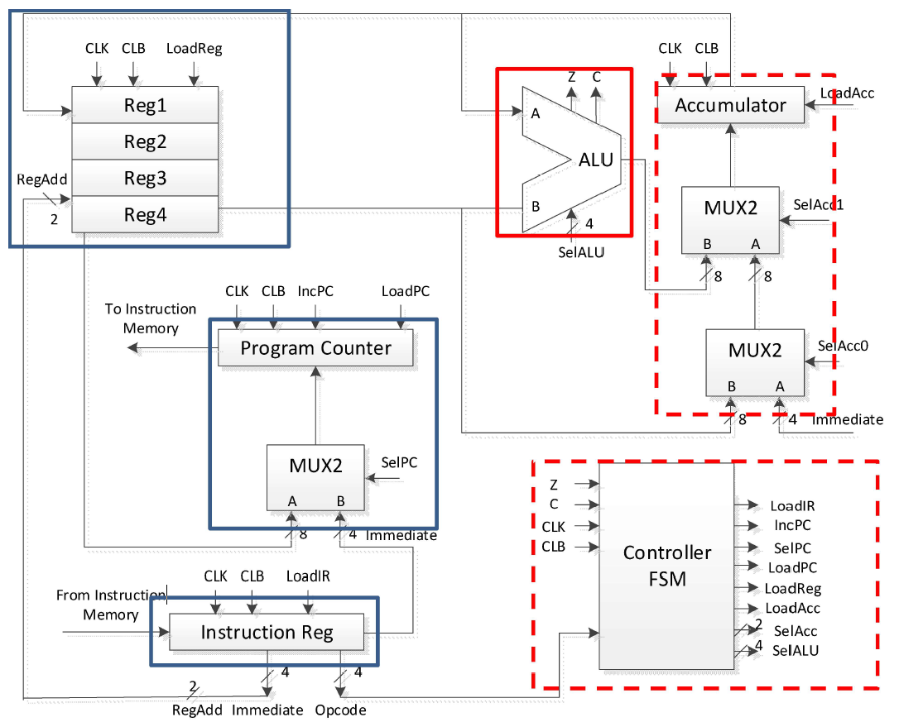
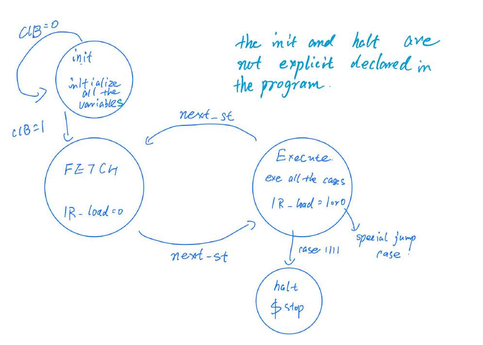
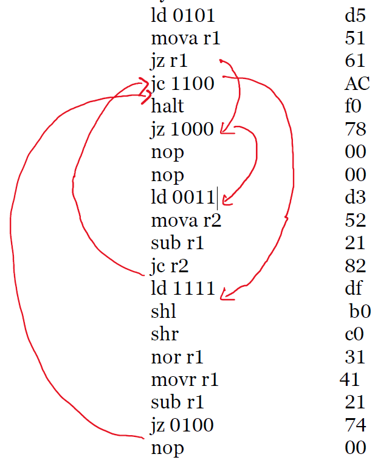
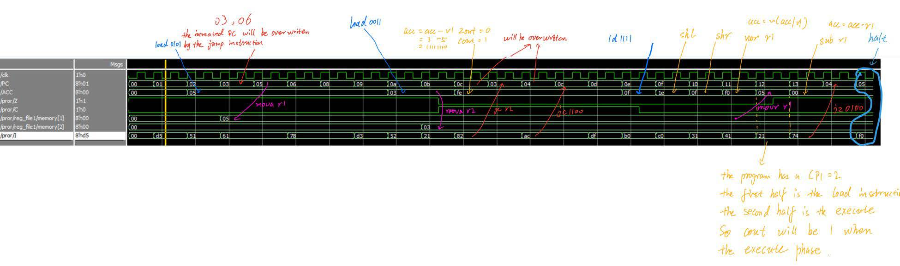
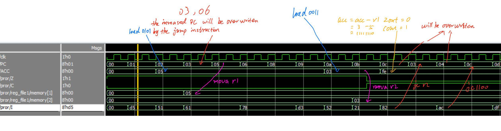

# 8-bit-microprocessor


## Introduction

8-bit microprocessor running in ModelSim. 

## Environment
- ModelSim

## Hirarchy

```
.
├── README.md
├── acc.v
├── alu.v
├── control.v
├── IR.v
├── processor.v (main module)
├── program_counter.v
├── register_file.v
```
## Block Diagram



## High-level design
    - Controller
        - Use a state machine to control the whole process


## Sample Input/Output
    - Input


    - Output




## I/O
    | Name |                Description                     | I/O | 
    |------|:----------------------------------------------:|:---:|
    | CLK  | Clock input                                    |  I  |
    | CLB  | Reset input (low active)                       |  I  |
    | INST | Instruction bus coming from instruction memory |  I  |
    | PC   | Address bus goes into instruction memory       |  O  |
    | ACC  | ACC register value (used for debugging purpose)|  O  | 

## Known Issues
- Program counter
    - The start of the PC is different from the sample program.
    - The program counter will increase by 1 even if jump happens, but PC will later be overwritten by the jump target PC.
Both of the issue won’t affect how the program works but will make expected ACC and expected PC different from the sample program.

## Usefull links
- [ModelSim](https://www.mentor.com/products/fv/modelsim/)

